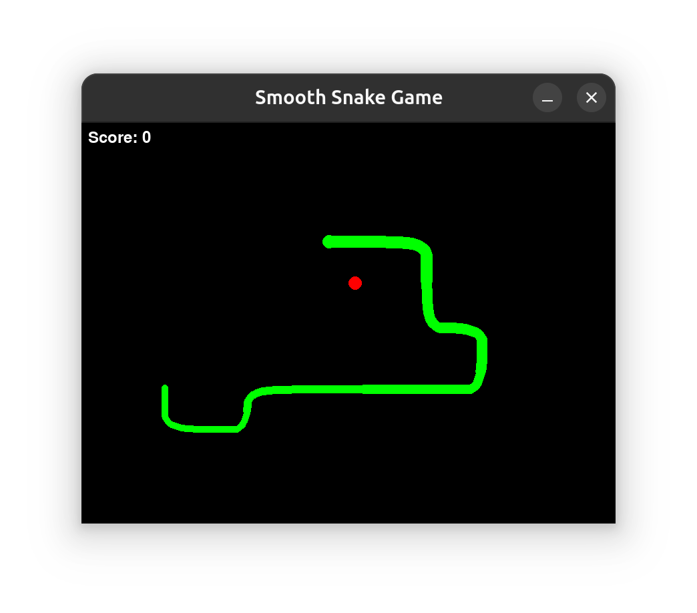

# 🎮 Smooth Snake Game ✨🐍

<div align="center">
  
  
  
</div>

---

🌈 **由 DeepSeek 精心制作的可爱贪吃蛇游戏！** 专为Python游戏爱好者设计的萌系小游戏，拥有丝滑移动和软萌画风～ (´• ω •`)ﾉ

 <!-- 请替换为您的截图文件路径 -->

## 🍎 主要特点
- 🚀 **真·丝滑移动**：基于浮点数坐标的流畅运动系统
- 🎨 **Q弹外观**：渐变透明度的圆润蛇身设计
- 🌈 **彩虹特效**：自动渐变的尾巴颜色（可选）
- ⚙️ **超多配置**：速度/尺寸/间距自由调整
- 🎵 **呆萌音效**（预留接口，需自行添加音效文件）

## 🛠️ 安装指南
```bash
# 1. 安装依赖
sudo apt install python3 python3-pip python3-dev libsdl2-dev

# 2. 安装Pygame
pip3 install pygame --user

# 3. 运行游戏
python3 cute_snake.py
```

## 🎮 游戏玩法
- 🕹️ **控制方式**  
  ↑↓←→ 方向键控制小蛇移动  
  🅿️ 任意键重新开始游戏
- 🍎 **游戏规则**  
  吃红色苹果长大 | 不要撞墙/咬自己 | 活得越久越厉害！

## ⚙️ 自定义配置
```python
# 在代码中修改这些参数：
cell_size = 20    # 蛇蛇的胖瘦程度
speed = 200       # 移动速度（建议150-300）
turn_smoothness = 0.2  # 转弯Q弹度（0=丝滑，1=僵硬）
body_spacing = 20 # 身体段间距（推荐15-25）
```

## 💌 特别感谢
- 感谢[深度求索人工智能助手](https://chat.deepseek.com/)的代码创作
- 感谢Pygame团队提供的游戏框架
- 感谢您选择这个可爱的小游戏！(≧ω≦)/

## 📜 许可证
MIT License © 2024 深度求索人工智能助手  
本仓库由 EveSunMaple 维护分发，上传者不持有代码著作权

完整授权文本见 [LICENSE](LICENSE)

---

🐍 ASCII蛇蛇友情出演：  
```text
　　　　　　/^\/^\  
　　　　　 _|__| O|  
　　 \/   /~     \_/ \  
　　  \____|__________/  \  
　　　　　\_______      \  
　　　　　　　`\     \                 \  
　　　　　　　 /     /                   \  
　　　　　　　/     /                     \ \  
　　　　　　 /     /                       \ \  
　　　　　　/     /                         \ \  
　　　　　 /     /             _----_        \ \  
　　　　　/     /           _-~      ~-_     | |  
　　　　 (      (        _-~    _--_    ~-_   _/  
　　　　　\      ~-____-~    _-~    ~-_    ~-_-~  
　　　　　 ~-_           _-~          ~-_       _-~  
　　　　　　~--______-~                ~-___-~
```